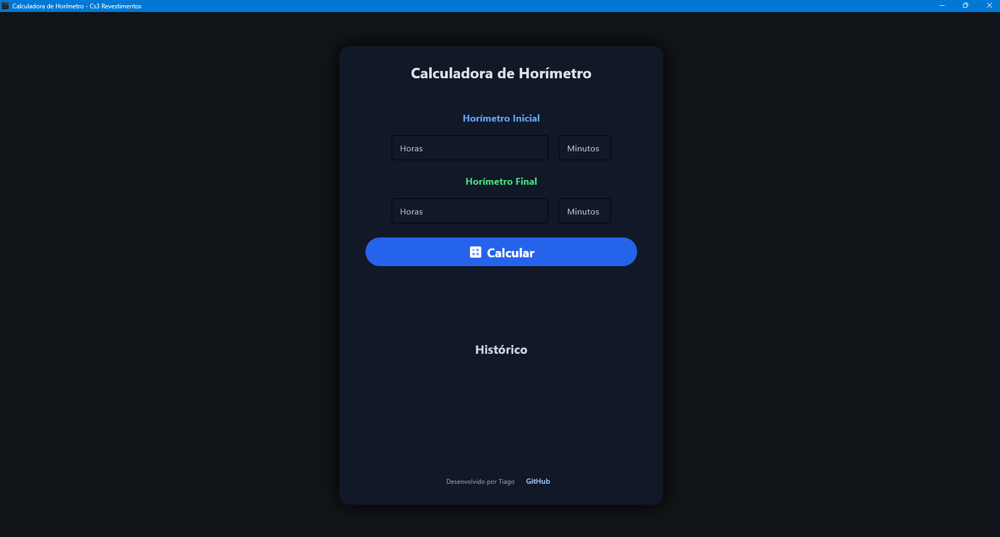

# Horímetro App

Sistema em Python para cálculo de tempo de corte de máquinas multifio utilizadas no setor de mármore e granitos.

---

## Imagem do aplicativo

## Sobre o projeto

Trabalho no setor de multifio em uma empresa de mármore e granitos, onde os operadores anotam o horímetro inicial e final das máquinas durante o corte dos blocos.

O cálculo era feito manualmente utilizando calculadora, então decidi desenvolver este sistema em Python para automatizar o processo e facilitar o cálculo do tempo total de corte das máquinas.

---

## Como funciona

O usuário informa:

- Horímetro inicial
- Horímetro final

Formato:

HORAS:MINUTOS

Exemplo:

12325:56
12330:20

O sistema:

- valida os dados
- converte para minutos
- calcula a diferença
- retorna o tempo total de corte

---

## Funcionalidades

- Entrada de horímetro inicial e final
- Validação do formato HORAS:MINUTOS
- Validação de minutos entre 00 e 59
- Cálculo do tempo total de corte
- Aviso para tempos de corte acima de 40 horas
- Confirmação antes de aceitar tempos acima do esperado
- Loop para calcular vários cortes
- Histórico dos cortes calculados durante a execução

---

## Tecnologias

- Python
- Flet
- PyInstaller
- Inno Setup
